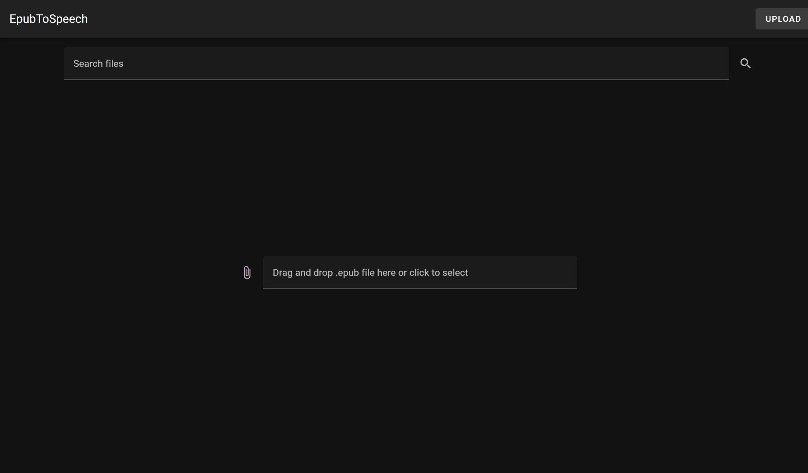
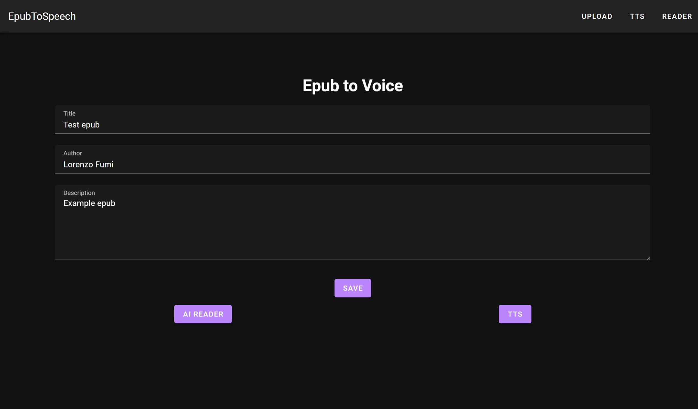
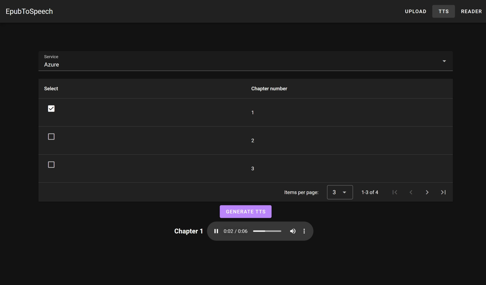
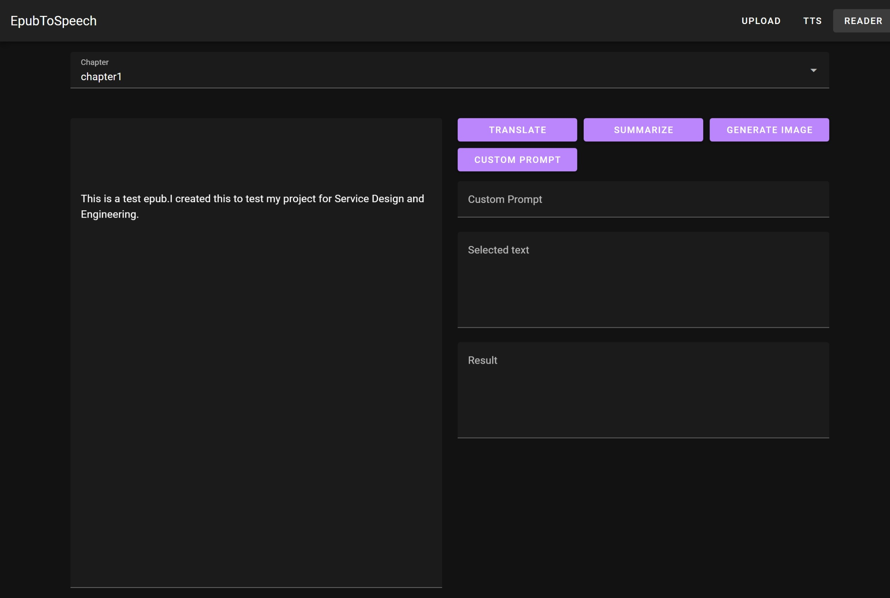
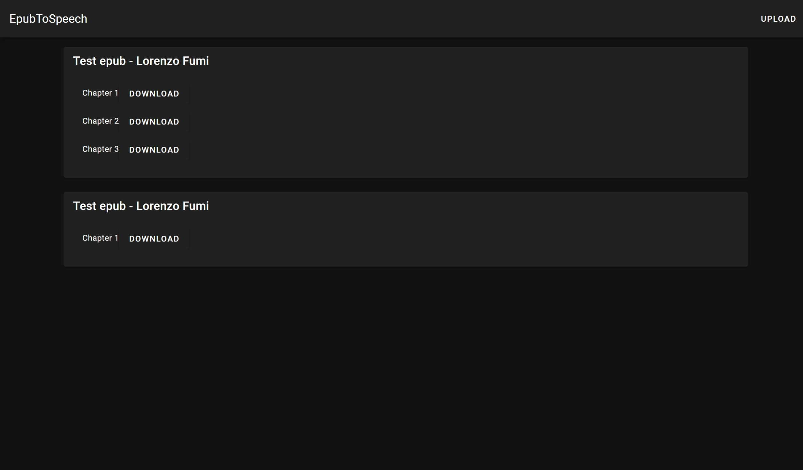
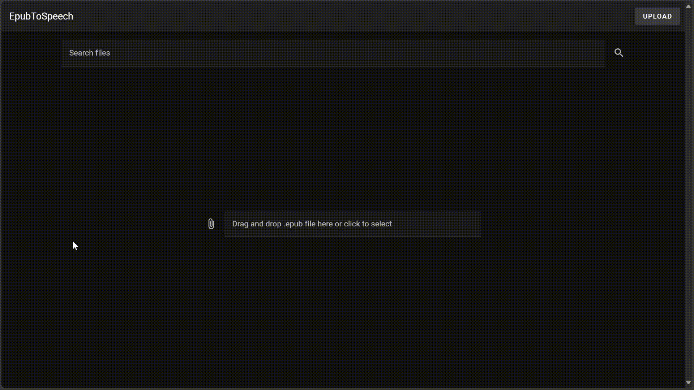
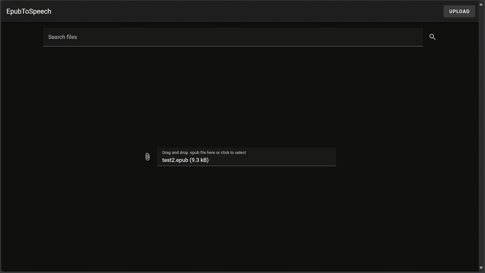

# Epub To Speech

This project is a web application where users can upload Epub files and use various services to translate certain chapters to voice (TTS). Additionally, users can use the GPT API to request information about the chapter, generate images, and more.

## Table of Contents

1. [Getting Started](#getting-started)
2. [Usage](#usage)
3. [Examples](#example-images)
4. [Libraries used](#libraries-used)
    - [Python](#python)
    - [Node](#node)

## Technologies Used

- Frontend: VueJS with Vuetify
- Backend: Python with Flask
- Supported TTS Services: Azure, OpenAI, ElevenLabs, and a local one (espeak for linux)

## Getting Started

1. Clone the repository

   ```cmd
   git clone https://github.com/DeeJack/EpubToSpeech.git
   ```

2. Run with docker!

   ```cmd
   ./start.sh
   ```

   OR:

   ```cmd
   docker-compose up --build
   ```

## URL

Frontend: http://localhost:4173/

Backend: http://localhost:5000/api/

Docs: http://localhost:5000/docs

## Usage

1. Navigate to the home page and upload an Epub file.
2. Insert in the form the information you want
3. Select the process you need: TTS or the AI Reader.

### TTS

1. Select the service to use (Azure, OpenAI, ElevenLabs, Local)
2. Choose the chapters to generate from the table.

### Reader

1. Select the chapter to read from the select element.
2. Use the buttons to do the actions (Translate, Image generation)

# Example images

## Home - Upload



## Form



## TTS



## AI Reader



## Search



## Example TTS


## Example Reader



## Search vid



## Libraries used

### Python

- flask
- python-dotenv
- openai
- ebooklib
- bs4
- azure-cognitiveservices-speech
- elevenlabs
- flask-swagger
- flask-swagger-ui
- flask-restx
- flask-cors
- pytest
- wheel
- py3-tts

### Node

- VueJS
- Vuetify
- Axios
